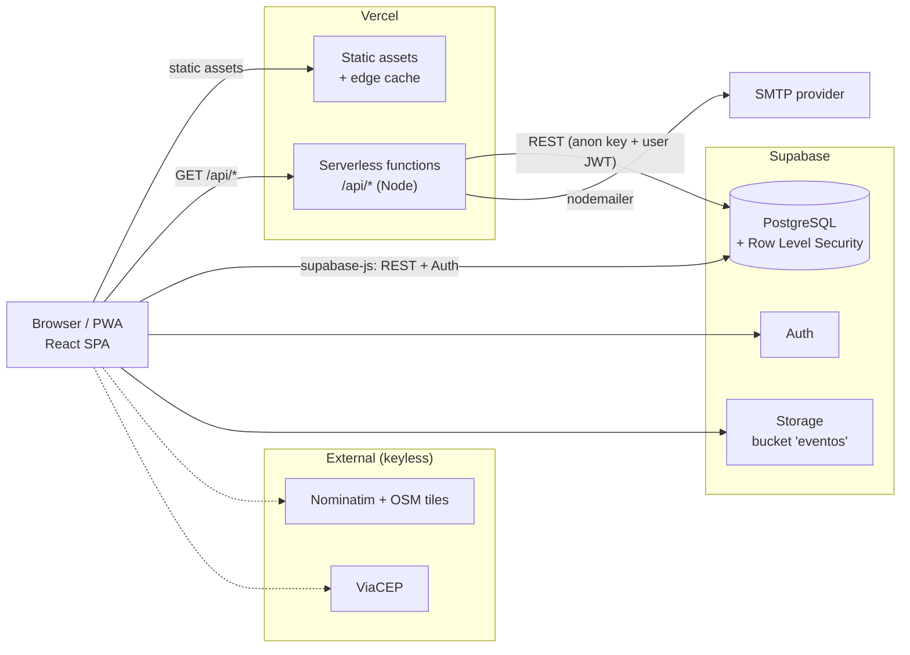

# Eventos Região

> An inclusive, region-focused platform for discovering and promoting local cultural, sporting and community events — built to strengthen local tourism and economy.

**Live:** <https://eventos-regiao.vercel.app>


---

## Overview

Small municipal, community and cultural events (a book fair, a street race, a *boi de mamão*
performance, a neighbourhood *festa junina*) are largely invisible on national ticketing
platforms — they are free, run by libraries, city departments or collectives, and have no
ticket to sell. **Eventos Região** is a discovery and curation layer for exactly those
events, organised by **city and proximity** rather than by nationwide search.

It ships as a **Progressive Web App**: installable, fast on low-end devices, and usable on an
unstable connection. It also exposes a small **public read API** so other regional sites can
embed the agenda.

The project was developed for **Atividade Extensionista III — Tecnologia Aplicada à Inclusão
Digital**, B.Sc. in Software Engineering, Centro Universitário Internacional UNINTER, aligned
with UN SDGs **8** (decent work and economic growth) and **11** (sustainable cities and
communities).

---

## Features

### Visitor (resident / tourist)
- Browse and filter events by **city, category, date range, price and format**.
- **"Near me"**: with the browser's geolocation, events are sorted by real distance from the
  visitor to the **venue** (Haversine), with an adjustable radius; online events always pass.
- **Interactive map** of an event's location (Leaflet + OpenStreetMap) with a one-tap
  "get directions" link to Google/Apple Maps.
- **City pages** that double as a "what's on in this town" destination guide.
- **RSVP** ("I'm going") with a public counter.
- Light / dark theme, respects `prefers-reduced-motion`.

### Organizer
- Email/password account (Supabase Auth) with self-service **password reset**.
- Submit events for free; they enter a **moderation queue** as `pending`.
- Suggest a city that isn't listed yet (address auto-geocoded; city held as *unapproved*
  until the event is approved).
- Image upload to Supabase Storage, or a URL, or an auto-generated gradient banner.
- **"My events"** dashboard with status, rejection reason and per-event indicators.
- Request a **paid highlight** for an event (manual, gateway-free flow).
- Transactional email on submission (receipt) and on approval / rejection.

### Team (moderators)
- Role derived from an allowlist (`equipe` table **and/or** `VITE_ADMIN_EMAILS`).
- Moderate the event queue (approve / reject with a reason).
- Add or approve cities from the panel, using the embedded **IBGE** municipality list
  (state → municipality cascade).
- Read contact-form messages, resolve highlight requests.
- **Metrics panel**: events by city, category, state and month (accessible charts with an
  equivalent data table).
- Email notification on every new submission, moderation result and contact message.

---

## Architecture



**Two runtime modes, one codebase**

| Mode | Trigger | Data source |
|---|---|---|
| **Production** | `VITE_SUPABASE_*` env vars present | Supabase (Postgres + Auth + Storage) |
| **Demo** | env vars absent | `public/dados/*.json`, local session, `localStorage` writes |

Demo mode makes the whole app (organizer and team flows included) runnable with no backend —
useful for local development and review.

---

## Tech stack

| Layer | Choice | Notes |
|---|---|---|
| UI | **React 18**, **React Router 6** | route-level code splitting via `React.lazy`; v7 future flags on |
| Build | **Vite 5** | `npm run build` = generate data → `vite build` → prerender SEO |
| Styling | **Tailwind CSS 3** | class-based dark mode, CSS-variable design tokens |
| PWA | **vite-plugin-pwa** (Workbox) | precache app shell, offline fallback, installable |
| Backend | **Supabase** | PostgreSQL, Auth (email/password + recovery), auto REST (PostgREST), Storage |
| Serverless | **Vercel Functions** (Node, ESM) | public read API + transactional email endpoint |
| Maps | **Leaflet 1.9** + OpenStreetMap tiles | imperative, lazy-loaded |
| Geocoding | **Nominatim** (OSM) forward + reverse; **ViaCEP** for postal codes | keyless, best-effort |
| Email | **nodemailer** | provider-agnostic SMTP; HTML templates in `api/_email.js` |
| Reference data | **IBGE Localidades API** | 5570 municipalities baked to `public/dados/municipios.json` |
| Tests | **Vitest** | 68 unit tests over the pure logic (`src/lib/*`) |
| Lint | **ESLint 9** (flat config) | react / hooks / refresh plugins |
| CI | **GitHub Actions** | lint + test + build on every push and PR |

---

## Data model

PostgreSQL on Supabase, with **Row Level Security enabled on every table**. Full DDL and
policies: [`supabase/schema.sql`](supabase/schema.sql).

| Object | Purpose | Access model (RLS) |
|---|---|---|
| `cidades` | Cities and their cultural identity | public read of `aprovada` rows; team manages all; an authenticated organizer may `insert` only as `aprovada = false` |
| `eventos` | Events (text slug PK, venue lat/lng, recurrence, sponsored flag, status) | public read of `aprovado`; authors read their own; team reads/writes all; **anyone** may `insert`, forced to `status = 'pendente'` |
| `equipe` | Moderator allowlist | a row is visible **only to its own owner** (prevents enumerating admins) |
| `presencas` | RSVPs | readable for counting; each user inserts/deletes **only their own** |
| `contatos` | Contact-form messages | `anon`/`authenticated` may `insert`; only team may `select` |
| `pedidos_destaque` | Paid-highlight requests | event owner creates/reads own; team updates (resolve) |
| `eventos_publicos` *(view)* | Contact-free projection of approved events | intended for anonymous reads |
| `is_equipe()` *(function)* | `security definer` check used across policies | — |
| Storage bucket `eventos` | Organizer image uploads | public read; authenticated upload; team delete |

**Secrets never live in the repo.** The client only ever holds the Supabase *anon* key,
which is safe precisely because RLS constrains it. SMTP credentials and the service-side
config exist only as Vercel environment variables.

---

## Public API

Read-only, permissive CORS, edge-cached. Reads from Supabase when configured, otherwise from
a build-time snapshot (`api/_dados.json`).

| Method | Route | Description |
|---|---|---|
| `GET` | `/api/eventos` | Approved events. Query: `cidade`, `uf`, `categoria`, `entrada`, `busca`, `de`, `ate`, `limite` |
| `GET` | `/api/eventos/:id` | One event by slug |
| `GET` | `/api/cidades` | Cities with event counts |

```bash
curl "https://eventos-regiao.vercel.app/api/eventos?uf=SC&categoria=cultura&limite=5"
```

---

## Local development

Requires **Node.js 20+**.

```bash
npm install
npm run setup     # scaffolds .env, generates sample data, prints next steps
npm run dev       # http://localhost:5173  — demo mode, no accounts needed
```

| Script | Does |
|---|---|
| `npm run dev` | Vite dev server |
| `npm run build` | regenerate data → production build in `dist/` → prerender SEO pages + sitemap |
| `npm run preview` | serve `dist/` locally |
| `npm run test` | Vitest |
| `npm run lint` | ESLint |
| `npm run gerar-dados` | regenerate `public/dados/*.json`, `supabase/*.sql`, API snapshot and SVG art |
| `npm run gerar-municipios` | refresh the IBGE municipality list |

Sample data has a **single source of truth**: [`scripts/dados.mjs`](scripts/dados.mjs). Edit
there and run `npm run gerar-dados`; everything else is generated.

### Environment variables

| Variable | Side | Purpose |
|---|---|---|
| `VITE_SUPABASE_URL` | client | Supabase project URL — *omit for demo mode* |
| `VITE_SUPABASE_ANON_KEY` | client | Supabase anon key (RLS-guarded) |
| `VITE_ADMIN_EMAILS` | client | comma-separated emails granted the **team** role |
| `VITE_SITE_URL` | client / build | canonical + Open Graph base URL |
| `SMTP_HOST` `SMTP_PORT` `SMTP_USER` `SMTP_PASS` `SMTP_FROM` | server | transactional email (any SMTP provider) |
| `EQUIPE_EMAILS` | server | recipients of team notifications (falls back to `VITE_ADMIN_EMAILS`) |

See [`.env.example`](.env.example). Backend setup: [`docs/GUIA-PUBLICACAO.md`](docs/GUIA-PUBLICACAO.md);
email: [`docs/SMTP.md`](docs/SMTP.md) and [`docs/EMAILS-SUPABASE.md`](docs/EMAILS-SUPABASE.md).

---

## Deployment (Vercel)

1. **New Project → Import** this repository. Vercel detects Vite and serves `/api` as functions.
2. Add the environment variables above (Production + Preview).
3. In Supabase: run `supabase/schema.sql`, then `supabase/storage.sql`; create the team users
   and insert their emails into `public.equipe`.
4. Every push to `main` deploys; pull requests get a preview URL.

Without the Supabase variables the site still deploys — in demo mode, with the sample agenda
and the API served from the snapshot.

---

## Project structure

```
api/                 serverless functions: public read API, /api/notificar (email), _email.js
public/dados/         generated JSON (events, cities, municipalities)
public/img/           generated SVG city/event art; curated CC-licensed photos
scripts/              dados.mjs (source of truth) + generators (data, SEO, municipalities)
src/
  componentes/        Header, CardEvento, FormularioEvento, MapaEventos, charts, carousel, ...
  paginas/
    organizador/      MinhaArea, NovoEvento
    painel/           Painel (metrics), Moderacao, Destaques, Cidades, Mensagens, Patrocinios
  lib/                api.js (data layer), auth.jsx, geo.js, geocode.js, meta.js (SEO),
                      metricas.js, cidade.js (geolocation ctx), upload.js, ...
  App.jsx             routes + route guards
supabase/             schema.sql (tables + RLS + is_equipe), storage.sql, generated seed
docs/                 publishing guide, SMTP guides, analysis (requirements, use cases)
legado/               first static prototype, kept for history
```

---

## Quality

- **Testing** — 68 Vitest unit tests covering the pure logic: distance/radius math, date and
  agenda helpers, metric aggregations, the data-layer filters, RSVP logic.
- **CI** — GitHub Actions runs `lint`, `test` and `build` on every push and pull request.
- **Accessibility** — semantic HTML, one `<h1>` per page, skip link, visible `:focus-visible`,
  keyboard-operable menus (`aria-expanded`/`aria-controls`), labelled inputs, `role="alert"`
  errors, `alt` text on informative images and `alt=""` on decorative ones, charts backed by a
  data table, `prefers-reduced-motion` honoured, palette contrast checked.
- **SEO** — per-page `<title>`/description/Open Graph/JSON-LD via a `useMeta` hook, plus a
  post-build step that prerenders static HTML per event and city and emits `sitemap.xml` /
  `robots.txt`.
- **Privacy (LGPD)** — the only personal datum collected is the organizer's contact, used only
  for moderation and **never exposed publicly** (enforced by RLS and the `eventos_publicos`
  view); the submission form requires explicit consent.

---

## Roadmap

- Scheduled email ("your event is in 2 days", "new event in your city") — needs `pg_cron` and a
  subscriber list.
- Payment gateway for paid highlights (currently a manual Pix flow).
- Sympla/Eventbrite affiliate hand-off for events that do sell tickets.
- Multi-region onboarding for city tourism departments.

---

## Team

Andrei Vinícius da Silveira (RU 4605228) · Gabriel Lenhardt (RU 4739897) ·
Gabriel Augusto Fernandes Ferreira Martins (RU 4704869)

## License

Academic, non-profit project. Photographic images under `public/img/` are either
CC-licensed (attributed on the in-app **Credits** page) or placeholders to be replaced with
authorised material before any official publication.
