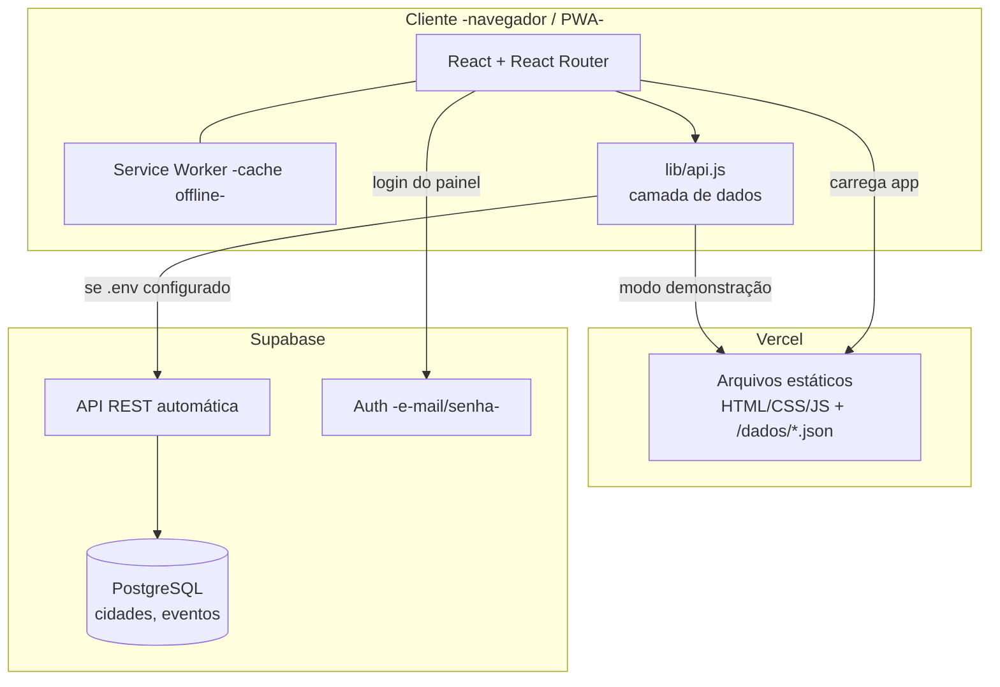
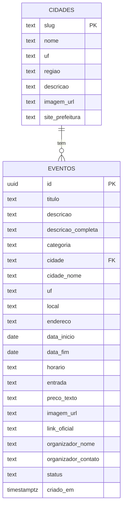
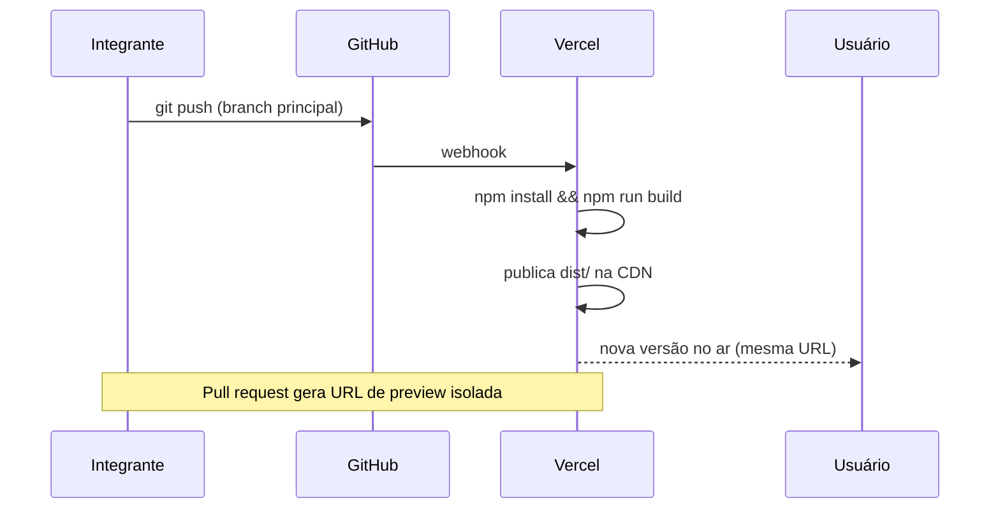

# Arquitetura — Eventos Região

## Visão geral

Aplicação **SPA (Single Page Application)** em React, servida como conteúdo estático pela Vercel, que conversa diretamente com o **Supabase** (banco PostgreSQL com API REST e autenticação gerenciadas). Não há servidor de aplicação próprio a manter.

## Decisões e justificativas

| Decisão | Por quê |
|---|---|
| **SPA + estático na Vercel** | Deploy simples, gratuito, com preview por PR; nada de servidor para manter numa equipe de estudantes |
| **Supabase como back-end** | Entrega "API de verdade" (REST + Auth + Postgres) sem escrever/hospedar servidor; plano gratuito; regras de acesso declarativas (RLS) |
| **Camada `lib/api.js`** | Isola o resto do código do back-end. Permite rodar 100% offline com `public/dados/*.json` para desenvolvimento e demonstração, e trocar para o Supabase só com variáveis de ambiente |
| **Tailwind CSS** | Padrões de espaçamento/cor consistentes, sem CSS global frágil; classes utilitárias facilitam manter contraste e responsividade |
| **PWA (vite-plugin-pwa)** | Requisito RF13: instalável e utilizável com internet ruim, comum no interior |
| **Filtros na URL** | Links de busca compartilháveis; histórico do navegador funciona |

## Modelo de dados

- `categoria` ∈ {cultura, esporte, comunitario, educacao, negocios, gastronomia}
- `entrada` ∈ {gratuito, pago, misto}
- `status` ∈ {pendente, aprovado, recusado}

## Segurança (RLS no Supabase)

| Operação | Quem pode | Regra |
|---|---|---|
| Ler cidades | qualquer um | `select` liberado |
| Ler eventos | qualquer um | apenas `status = 'aprovado'` |
| Inserir evento | qualquer um | somente com `status = 'pendente'` |
| Ler todos os eventos / atualizar | equipe autenticada | `to authenticated` |
| Gerenciar cidades | equipe autenticada | `to authenticated` |

O contato do organizador fica fora da `view eventos_publicos`, usada para leitura pública.

## Fluxo de deploy

## Evoluções previstas (pós-análise)

- Substituir imagens placeholder por material autorizado.
- Área do organizador (login) para acompanhar o status do evento.
- Favoritos e lembretes (exigiria conta de usuário).
- Painel com métricas (eventos por cidade, por mês).
- Internacionalização de datas por fuso configurável.
