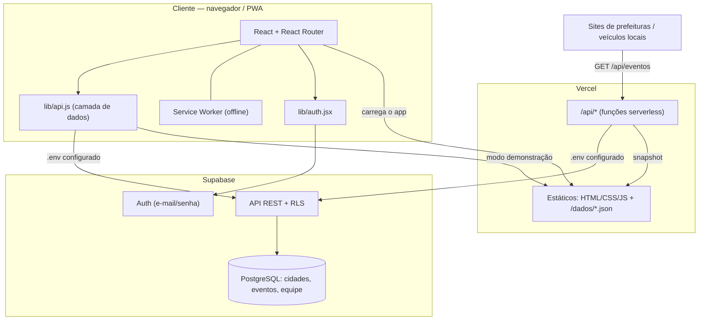
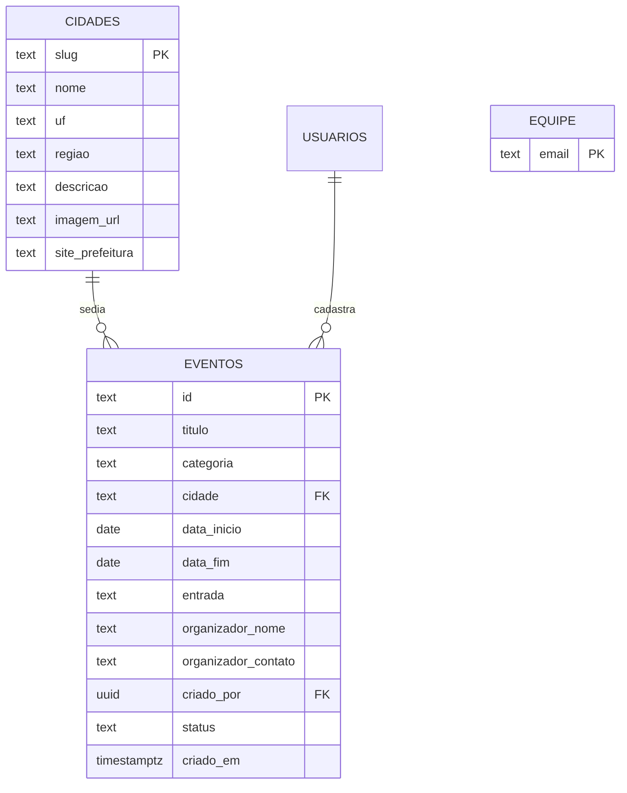
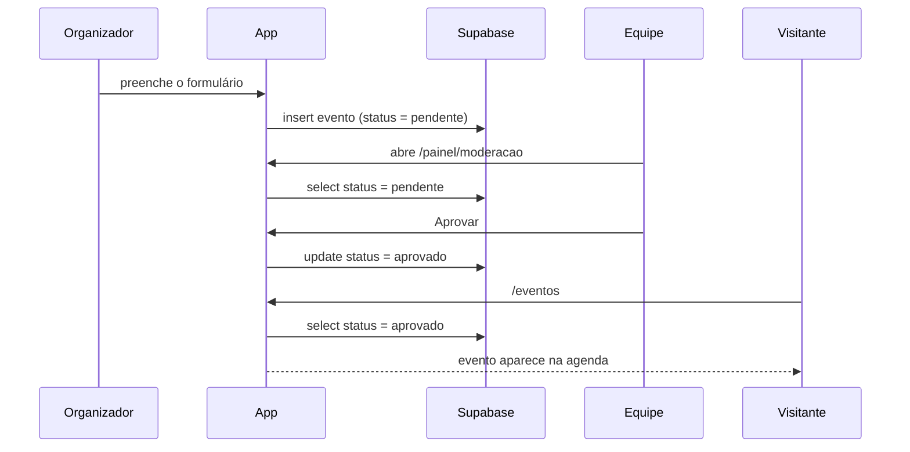
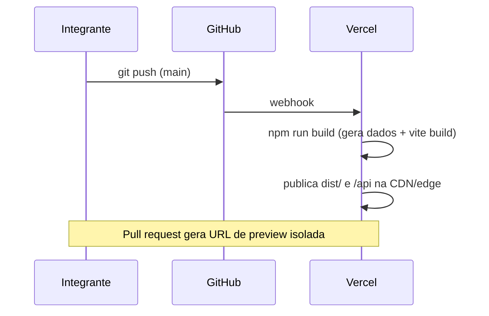

# Arquitetura — Eventos Região

## Visão geral

Aplicação **SPA (Single Page Application)** em React, servida como conteúdo estático pela Vercel, que conversa com o **Supabase** (PostgreSQL + API REST + Auth gerenciados) e expõe uma **API pública de leitura** por funções serverless. Não há servidor de aplicação próprio a manter.

## Papéis e acesso

| Ator | Autenticação | Pode |
|---|---|---|
| **Visitante** | nenhuma | ler eventos aprovados e cidades; enviar evento (entra como `pendente`) |
| **Organizador** | Supabase Auth | tudo do visitante + ver/gerir os eventos que **ele mesmo** criou |
| **Equipe** | Supabase Auth + e-mail em `public.equipe` / `VITE_ADMIN_EMAILS` | ler todos os eventos, aprovar/recusar, ver métricas |

O papel é resolvido no cliente por `papelDoEmail()` e no banco pela função `is_equipe()`, usada nas políticas de RLS.

## Decisões e justificativas

| Decisão | Por quê |
|---|---|
| **SPA + estático na Vercel** | Deploy simples e gratuito, preview por PR, nada de servidor para manter |
| **Supabase como back-end** | Entrega banco + REST + Auth sem escrever/hospedar servidor; regras de acesso declarativas (RLS) |
| **Camada `lib/api.js`** | Isola o app do back-end; permite rodar 100% offline com `public/dados/*.json` para desenvolvimento e demonstração |
| **API serverless `/api`** | Dá um endpoint estável e com CORS para terceiros reaproveitarem a agenda — reforça o caráter de extensão |
| **`scripts/dados.mjs` como fonte única** | Um só lugar para os dados de exemplo; o gerador produz JSON, SQL e imagens, evitando divergência |
| **Tailwind CSS** | Espaçamento/cor consistentes sem CSS global frágil; facilita manter contraste e responsividade |
| **PWA** | Instalável e utilizável com internet ruim, comum no interior |
| **Gráficos próprios (barras de uma matiz + tabela)** | Métricas simples de magnitude; sem dependência pesada e acessíveis por padrão |

## Modelo de dados

- `categoria` ∈ {cultura, esporte, comunitario, educacao, negocios, gastronomia}
- `entrada` ∈ {gratuito, pago, misto}
- `status` ∈ {pendente, aprovado, recusado}

## Segurança (RLS no Supabase)

| Operação | Regra |
|---|---|
| Ler cidades | liberado |
| Ler eventos | `status = 'aprovado'` **ou** `criado_por = auth.uid()` **ou** `is_equipe()` |
| Inserir evento | apenas com `status = 'pendente'` e `criado_por` nulo ou igual ao próprio usuário |
| Atualizar evento | apenas `is_equipe()` |
| Gerir cidades | apenas `is_equipe()` |

O contato do organizador fica fora da `view eventos_publicos`, usada para leitura anônima.

## Fluxo do evento

## Fluxo de deploy

## Evoluções previstas (pós-análise)

- Substituir imagens placeholder por material autorizado.
- Edição de evento pelo próprio organizador enquanto estiver pendente.
- Favoritos e lembretes por usuário.
- Métricas com série temporal de envios e taxa de aprovação.
