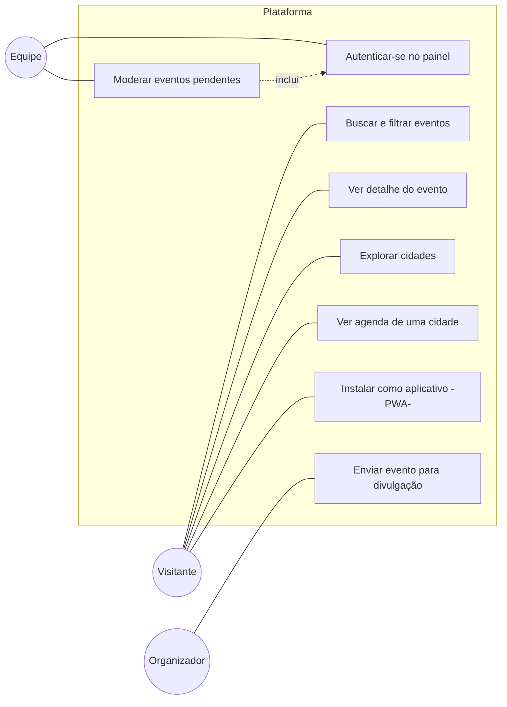

# Casos de uso — Eventos Região

## Atores

- **Visitante** — qualquer pessoa (morador ou turista), sem login.
- **Organizador** — visitante que envia um evento (não tem login nesta fase).
- **Equipe** — integrante do projeto, autenticado, responsável pela moderação.

## Diagrama de casos de uso

## Fluxos principais

### UC5 — Enviar evento para divulgação

**Ator:** Organizador
**Pré-condição:** nenhuma.

1. O organizador acessa **Divulgue seu evento**.
2. Preenche nome, descrição, categoria, cidade, local, data(s), tipo de entrada, contato e demais campos opcionais.
3. Marca o consentimento de uso dos dados.
4. Envia o formulário.
5. O sistema valida os campos obrigatórios e as regras RN02.
6. O sistema grava o evento com status `pendente` e `criado_em` = agora.
7. O sistema confirma o envio e informa que o evento passará por revisão.

**Fluxos alternativos**
- **5a.** Campo inválido → o sistema destaca o campo, mostra a mensagem de erro (`role="alert"`) e move o foco para o primeiro erro; o envio não ocorre.
- **6a.** Back-end indisponível / não configurado → o sistema salva o rascunho localmente e avisa que está em modo demonstração.

### UC7 — Moderar eventos pendentes

**Ator:** Equipe
**Pré-condição:** usuário autenticado (UC6).

1. A equipe acessa **/painel/moderacao**.
2. O sistema lista os eventos com status `pendente`, do mais antigo ao mais novo, com todos os dados (inclusive contato).
3. Para cada evento, a equipe escolhe **Aprovar** ou **Recusar**.
4. O sistema atualiza o status (`aprovado` / `recusado`) e remove o item da fila.
5. Eventos aprovados passam a aparecer na agenda pública imediatamente.

**Fluxos alternativos**
- **1a.** Sessão ausente/expirada → o sistema redireciona para `/painel` (login).
- **2a.** Fila vazia → o sistema exibe estado vazio "Nada na fila".

### UC1 — Buscar e filtrar eventos

**Ator:** Visitante

1. O visitante abre **Agenda de eventos**.
2. O sistema mostra, por padrão, os eventos que ainda não terminaram (RN04), ordenados por data.
3. O visitante ajusta os filtros (texto, cidade, categoria, entrada, período).
4. O sistema atualiza a lista e a contagem de resultados; os filtros ficam refletidos na URL (compartilhável).
5. Sem resultados → o sistema exibe estado vazio com ação para limpar os filtros.
