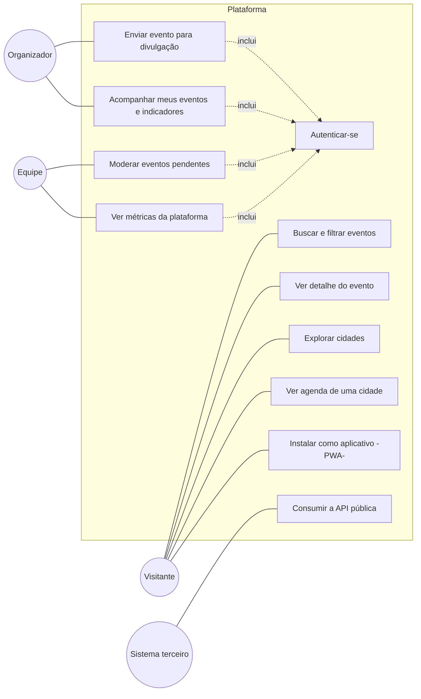

# Casos de uso — Eventos Região

## Atores

- **Visitante** — qualquer pessoa (morador ou turista), sem login.
- **Organizador** — pessoa autenticada que cadastra e acompanha os próprios eventos.
- **Equipe** — integrante do projeto, autenticado, responsável pela moderação e pelas métricas.
- **Sistema terceiro** — site externo que consome a API pública de leitura.

## Diagrama de casos de uso

## Fluxos principais

### UC5 — Enviar evento para divulgação

**Ator:** Organizador
**Pré-condição:** nenhuma.

1. O organizador acessa **Divulgue seu evento**.
2. Preenche nome, descrição, categoria, cidade, local, data(s), tipo de entrada, contato e demais campos opcionais.
3. Marca o consentimento de uso dos dados.
4. Envia o formulário.
5. O sistema valida os campos obrigatórios e as regras RN02.
6. O sistema grava o evento com status `pendente` e `criado_em` = agora.
7. O sistema confirma o envio e informa que o evento passará por revisão.

**Fluxos alternativos**
- **5a.** Campo inválido → o sistema destaca o campo, mostra a mensagem de erro (`role="alert"`) e move o foco para o primeiro erro; o envio não ocorre.
- **6a.** Back-end indisponível / não configurado → o sistema salva o rascunho localmente e avisa que está em modo demonstração.

### UC7 — Moderar eventos pendentes

**Ator:** Equipe
**Pré-condição:** usuário autenticado (UC6).

1. A equipe acessa **/painel/moderacao**.
2. O sistema lista os eventos com status `pendente`, do mais antigo ao mais novo, com todos os dados (inclusive contato).
3. Para cada evento, a equipe escolhe **Aprovar** ou **Recusar**.
4. O sistema atualiza o status (`aprovado` / `recusado`) e remove o item da fila.
5. Eventos aprovados passam a aparecer na agenda pública imediatamente.

**Fluxos alternativos**
- **1a.** Sessão ausente/expirada → o sistema redireciona para `/painel` (login).
- **2a.** Fila vazia → o sistema exibe estado vazio "Nada na fila".

### UC9 — Acompanhar meus eventos e indicadores

**Ator:** Organizador
**Pré-condição:** autenticado.

1. O organizador acessa **Minha área**.
2. O sistema mostra indicadores (total, publicados, em revisão, ainda vão acontecer) e a lista dos eventos que ele cadastrou, com o status de cada um.
3. Para eventos publicados, um link leva à página pública do evento.
4. Um botão leva ao cadastro de um novo evento (UC5 a partir da área logada).

### UC10 — Ver métricas da plataforma

**Ator:** Equipe
**Pré-condição:** autenticado e com e-mail na lista da equipe.

1. A equipe acessa **/painel**.
2. O sistema calcula, sobre todos os eventos, os KPIs (publicados, aguardando revisão, cidades e estados ativos, próximos 30 dias, % gratuitos) e os gráficos de eventos por cidade, categoria, estado e mês.
3. Cada gráfico oferece uma tabela equivalente para leitura assistida.

### UC11 — Consumir a API pública

**Ator:** Sistema terceiro

1. O sistema faz `GET /api/eventos` (com filtros opcionais) ou `GET /api/cidades`.
2. A plataforma responde JSON com CORS liberado e cabeçalho de cache.
3. Apenas eventos aprovados são retornados; o contato do organizador nunca é incluído.

### UC1 — Buscar e filtrar eventos

**Ator:** Visitante

1. O visitante abre **Agenda de eventos**.
2. O sistema mostra, por padrão, os eventos que ainda não terminaram (RN04), ordenados por data.
3. O visitante ajusta os filtros (texto, cidade, categoria, entrada, período).
4. O sistema atualiza a lista e a contagem de resultados; os filtros ficam refletidos na URL (compartilhável).
5. Sem resultados → o sistema exibe estado vazio com ação para limpar os filtros.
